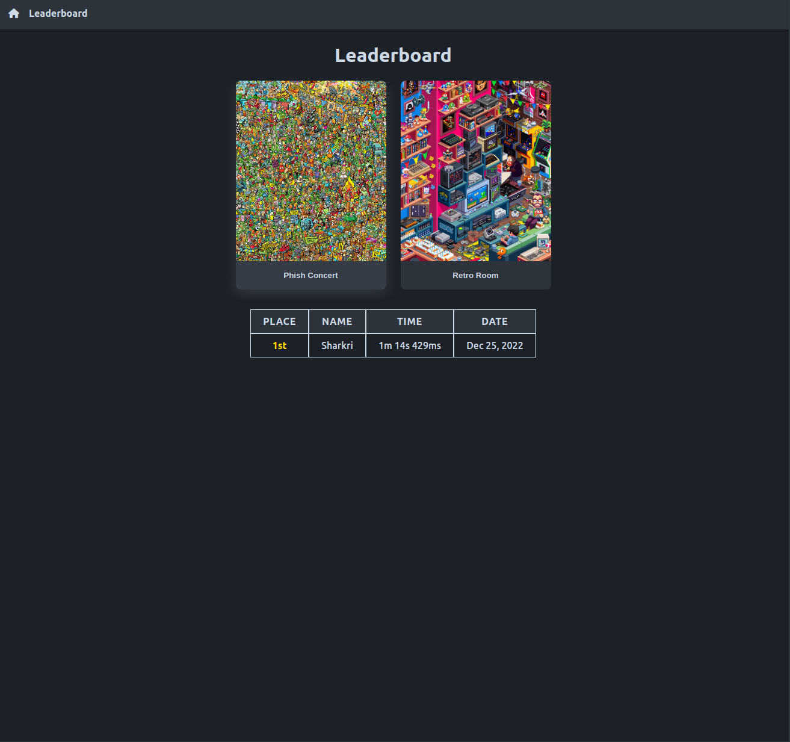

# where-is-waldo

### Summary

This app implements an interactive version of "Where's Waldo?", a game where players try to find several characters hidden inside a picture. In this version, players are timed. Upon completion, the user may enter their name into a leaderboard stored in Firebase.

> See it live on [where-is-waldo-3e672.web.app/](https://where-is-waldo-3e672.web.app/)
> 

### Technologies

- ReactJS
- react-router-dom
- Vanilla CSS
- Firebase
- React Testing Library

### Features

- Responsive design
- Multiple levels stored in Firebase
- Real-time character verification
- Global leaderboard without login
- Multiple levels to play

### Screenshots

#### Level

#### Level Complete

#### Leaderboard

#### 404 page

